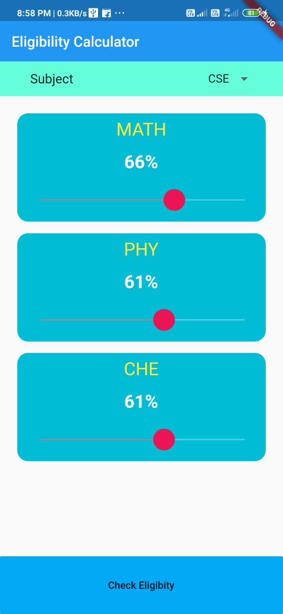
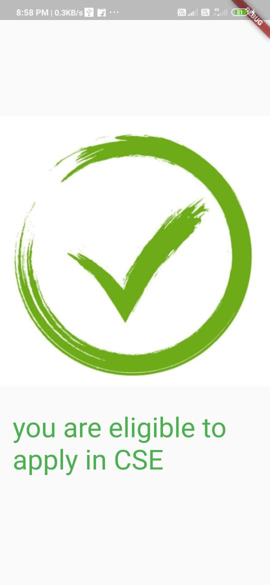
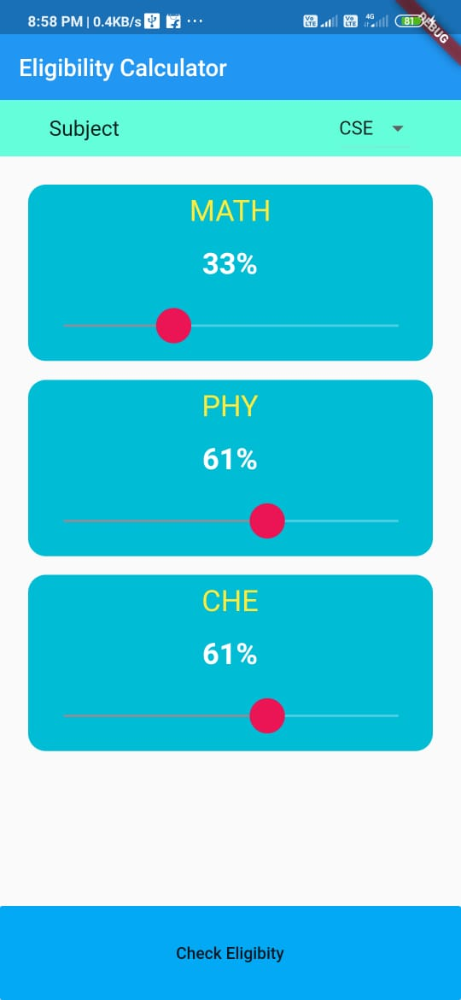
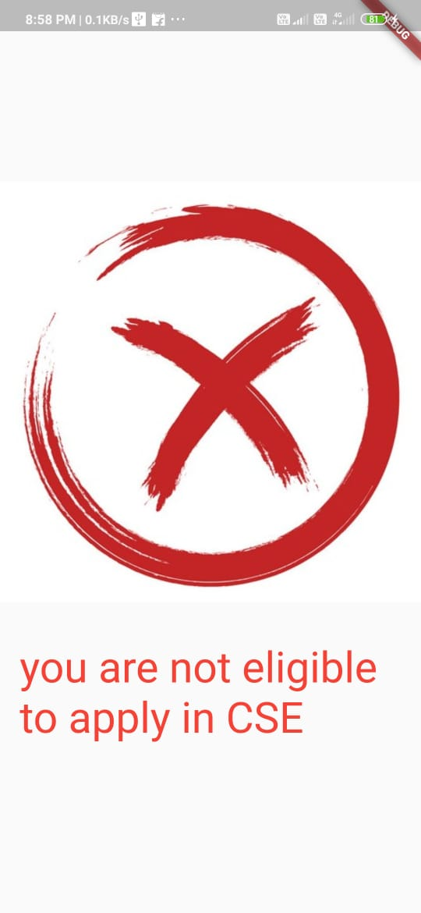

# ADMISSION ELIGIBILITY FINDER APP

A simple application that can be used to check, if he/she may elect to get admission.
This application takes the percentage of three subjects then tells the user the result.
limitation: It's a sample app.

## SCREENSHOTS

<table>
 <tr>
   <td>HOME SCREEN</td>
   <td>ELIGIBILITY SCREEN</td>
 </tr>
 <tr>
   <td></td>
   <td></td>
 </tr>
</table>

<table>
 <tr>
   <td>HOME SCREEN</td>
   <td>ELIGIBILITY SCREEN</td>
 </tr>
 <tr>
   <td></td>
   <td></td>
 </tr>
</table>
